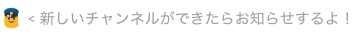
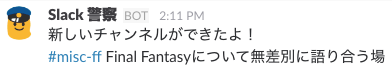
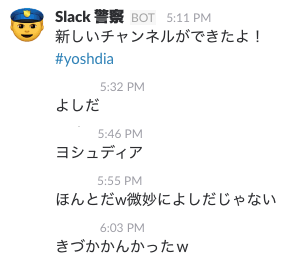
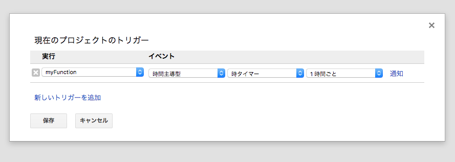
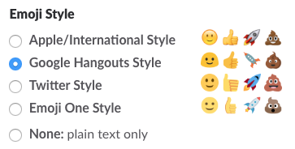
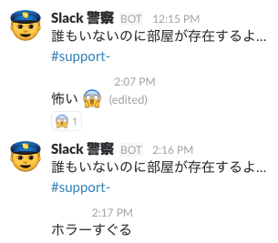
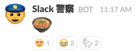
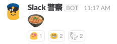
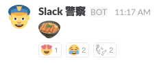
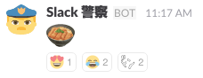

[Supership株式会社 Advent Calendar 2016 - Qiita](http://qiita.com/advent-calendar/2016/supership) の15日目の記事になります。

# はじめに

この記事は趣味でやっていることをただひたすらまとまりもなく記述しています。
また、実装が面倒なので監視して見えてきたものを先に書きます。

さて、弊社は3つの会社が合併してできた会社です [※1](http://blog.livedoor.jp/kensuu/archives/55408011.html) 。
現在（2016/12/15）の数字ですが、[Supership株式会社](https://supership.jp/)の社員数は240名になっています。[Syn.グループ](http://www.syn-hd.com/) を合わせるともうどうなってるのかわかりません。
個人的な立ち位置としては急に仲間が2, 300人くらい増えた気分でなにがどうなっているのか全くわからない状態でした。なんとかして現状を把握したいという気持ちが高まり、ならば Slack のチャンネルを監視してみんなの活動をチェックしようと思い至りました。

というこの記事を書くのに咄嗟に思いついた理由付けの文章はここまでにします。
Slack のチャンネルが規則性もなくどんどん作成されていくのが残念だったので、命名規則が守られているかどうかをチェックするのに勝手に作りました。
勝手に作る際に、Heroku や AWS とかも考えましたがさくっと作ってさくっと消したい、余計なお金をかけずに監視したいという気持ちがあったので、Google に魂を売ることにしました。いや、元から信者なので利用させていただくことにしました。

# 前提



新規作成されたチャンネルの命名規則をチェックすることが最大の目標のため、会話をチェックすることは今回していません。
チャットの中身を見られることほど不愉快なものはないので、Slack API から取得できるチャンネルの目的やトピック、アーカイブされたかどうか、新規作成されたチャンネルかどうかだけを見ることにしています。

# 監視方法

[Slack Web API](https://api.slack.com/web) の [channels.list](https://api.slack.com/methods/channels.list) を利用して取得できる情報を利用します

```
{
  "id": "CKOKOHAID",
  "name": "channel-name",
  "is_channel": true,
  "created": 1446192005,
  "creator": "UKOKOHAUSERID1",
  "is_archived": false,
  "is_general": false,
  "is_member": false,
  "members": [],
  "topic": {
    "value": "",
    "creator": "",
    "last_set": 0
  },
  "purpose": {
    "value": "purpose",
    "creator": "UKOKOHAUSERID2",
    "last_set": 1446192006
  },
  "num_members": 0
}
```

大まかに `topic`, `purpose`, `is_archived`, `num_members` を今回は利用しました。

それぞれの値が変わったら Slack に通知します。

**（通知例）**



# 監視結果

個人的にわかったことです。

## 作成されるチャンネルをチェックしたい人はちらほらいた。

こっそり作成した #slack-police (仮名) チャンネルですが、20名程度の人が join してくれてます。

## チャンネルの作成はハイプ・サイクルに似ている。

- 最初はみんなチャンネル作成をためらうので作る人は限られていました（黎明期）。
- 次第に慣れて、娯楽用チャンネルが大量発生します（流行期）。
- 大量に作りすぎた結果、コミュニケーションの場が増えて管理できなくなり、減らす動きがでてきます（幻滅期）。
- 現在はチャンネル作成も回復期 or 安定期になっているのでいい状態に保たれてます（回復期 or 安定期）。

## 使われていないチャンネルは生き続ける

使ってないけど join してる人がいることによって利用しているのかどうか判断がつかなくなります。
Slack がちょっとしたゴミ屋敷状態になる原因がこれです。
使っていないチャンネルを整理することが解決への一歩です。

## 分報を書く人がいる

Twitter の社内版みたいな活動をするための #time-tanjo (仮名) チャンネルのようなものを作る文化が生まれていました。

## typo により架空の人物名チャンネルができる

DM をするときに `Cmd+K` を使って特定の人に話しかける人がいるせいなのか人物名のチャンネルがよくできます。
じわじわくるものが多くて好きです。



# まとめ

監視というよりは観察に近いです。
アリの観察に近い気分 (\*´艸｀\*)。
チャンネルの目的やトピックを見るのも面白いです。
ぜひ1度こっそりやってみてはいかがでしょうか。

# 実装

ここからは使ってみたい人向けです。

タイトル通り Slack と Google Spreadsheet と Google Apps Script を使います。
すべての処理は Google Apps Script で行います。
Google Spreadsheet は DB のような扱いです。

## Slack の API トークンを取得する

Slack API には [RTM API](https://api.slack.com/rtm) の対応やOAuth2での認証などありますが面倒なのでやってません。
トークンを設定する方式のみ使えます。

トークンを取得する方法は2パターンあります

1. [Generate test tokens](https://api.slack.com/web#authentication) を使う

2. [Build Your Own | Slack](https://slack.com/apps/build) で Bot を作成する

1 はトークンを生成した人が偽装して通知しているような挙動になります。
2 は Bot User が通知します。

## Google Spreadsheet の準備

1. [Google Drive へ移動](https://drive.google.com/)

2. スプレッドシートを新規作成します
    スプレッドシートそのものはデータの保管庫や監視対象から除外するチャンネルを設定するのに利用します

3. データを管理するシート名を `リスト` にします
    今回はこの文章内の整合性を保つために `リスト` にしていますが好きに決めてOKです。
    簡単に言うと DB のテーブル名に相当します。
    スクリプトを1度走らせると1列目にJSON形式のデータが格納されます。
    各セルにデータを格納することも考えましたが数値が自動的に変換されてしまうので断念しました。

## Google Apps Script の準備

1.  スプレッドシートからスクリプトエディタを開く
    [ツール] - [スクリプト エディタ] を押すと開きます

2. `main.gs` に以下のコードを書く

    ```
    function myFunction() {
      var spreadsheet = SpreadsheetApp.getActiveSpreadsheet();
      var sheet = spreadsheet.getSheetByName("リスト");
      var token = "fuga"; // fuga ではなくSlack のトークンを入れる
      var slackpolice = getInstance(sheet, token);
      slackpolice.setAsUser(true); // test tokens の場合は不要なのでこの行を削除する
      slackpolice.setChannel("#slack-police");
      slackpolice.addDataType(1, "新しいチャンネルができたよ！", DATATYPE_NEW_CHANNEL);
      slackpolice.addDataType(2, "チャンネルの目的が更新されたよ！", DATATYPE_PURPOSE);
      slackpolice.addDataType(3, "トピックが更新されたよ！", DATATYPE_TOPIC);
      slackpolice.addDataType(4, "誰もいないのに部屋が存在するよ…", DATATYPE_ARCHIVE);
      slackpolice.patrol();
    }
    ```

3. `slackpolice.gs` を作成

    `main.gs`とは別にスクリプトファイルを新規作成して

    [slack-police/slackpolice.gs at master · tanjo/slack-police](https://github.com/tanjo/slack-police/blob/master/lib/slackpolice.gs)

    内のコードをコピー&ペースト
    実装内容についてはコードを見て確認してください

## トリガーの設置

1時間に1回 `myFunction` を走らせるためのトリガーを設定します。
スクリプトエディタで設定できます。

1. [リソース] - [現在のプロジェクトのトリガー] を押します
2. `トリガーが設定されていません。今すぐ追加するにはここをクリックしてください。` をクリック
3. [`時間主導型`] - [`時タイマー`] - [`1時間ごと`] を設定して保存する

    

これでトリガーの設置完了です。
放置しているだけで勝手に通知してくれるようになります。

## コードについて

[tanjo/slack-police](https://github.com/tanjo/slack-police)

趣味なのでソースコードは Coffeescript で書いています。
Google Apps Script ならではの仕様にハマったりしましたが、それほど苦ではありません。
Pull Request や Issue もお待ちしております。

# おまけ

## Emoji Style 問題



絵というものは印象にかなり影響してきます。
普段、 **Google Hangouts Style** を使っているのでかわいい `:cop:` が表示されることを念頭に置いて通知を作成していました。
しかし、みんなが Google Hangouts Style わけではないので、他の Emoji Style を使っているの人には全く違った印象になります。
最近まで気づけていませんでした。



### 実験

印象の違いがどの程度生まれるのか。
"警察"といえば"取調べ"といえば"カツ丼"。
ということで :cop: アイコンな bot にカツ丼の絵文字を発言させて試してみたいともいます。

Apple/International Style



Google Hangouts Style



Twitter Style



Emoji One Style



### 感想・結果

Twitter Style はカツ丼というよりハンバーガーな印象。
Emoji One Style はカツ丼というよりは点心な印象。

かなり印象が違うのでアイコンは注意して選ぶとよさそうです。
もしくは、新しく Emoji を登録して利用すれば解決します。
